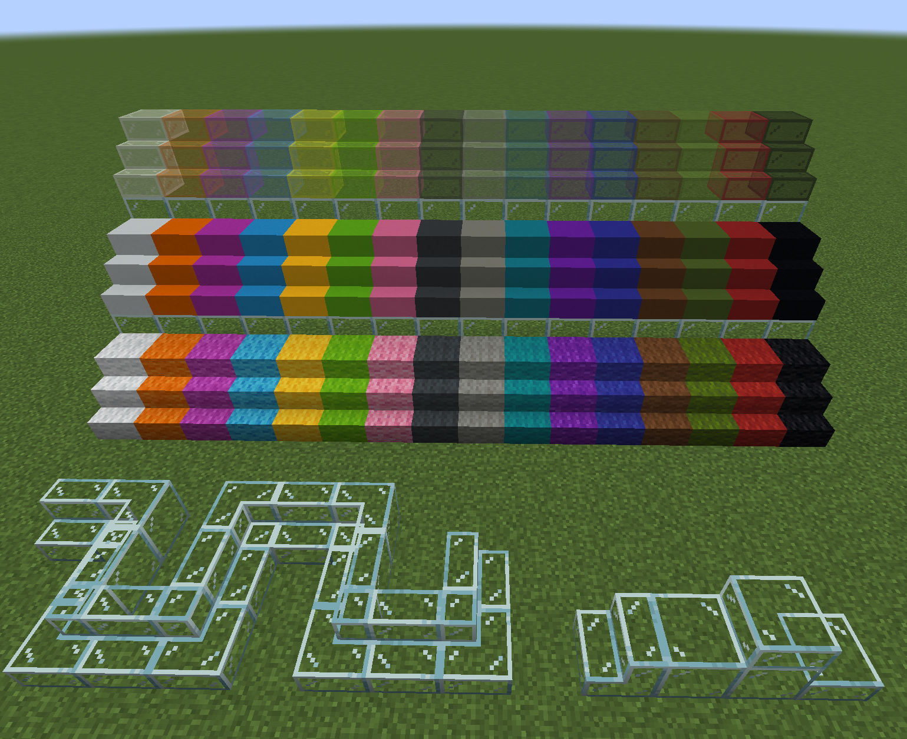

# Kevyn's Vanilla Complement: Blocks
 

Curseforge release: [KVCBlocks - Mods - Minecraft - CurseForge](https://www.curseforge.com/minecraft/mc-mods/kvc-blocks)

MCBBS release: [[1.17\][KVCBlocks]蛋挞君的原版补全方块篇——想要彩色玻璃和混凝土的楼梯和半砖吗？](https://www.mcbbs.net/thread-1239534-1-1.html)

## About this mod

KVCBlocks adding more vanilla style blocks, slabs and stairs to the game.

**current finished**:

- glass stairs and slab
- stained glass stairs and slabs
- concrete stairs and slabs
- wool stairs and slabs

**future plan**:

- glass, concrete, wool's walls
- leaf, iron, gold, diamond (and other material)'s stairs, slabs, walls
- some material's doors, carpets, etc
- some furnitures
- more...

screenshot:

This mod is one of my early works, there are still many imperfections, and my development skills are not mature as well. If you are going to add this mod to your game, please pay attention to risks, and remember to feedback problems, update in time, and give me some support or encouragement, thx
